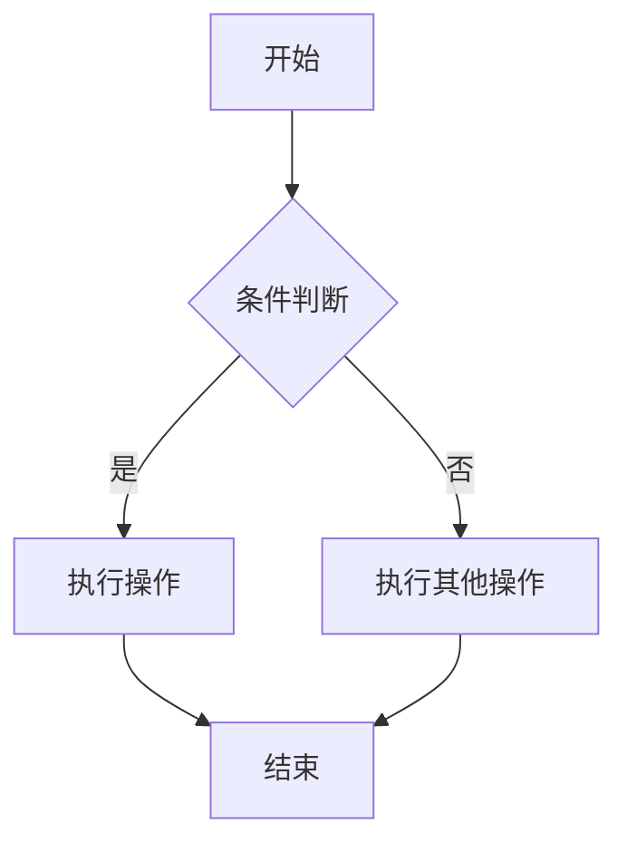

# LLM Conversation Log

## Request

**Role:** system

你是一个助手

**Role:** user

触发 stop 的长输出

**Role:** assistant

MOCK_RESPONSE::触发 stop 的长输出MOCK_RESPONSE::触发 sto [Stopped]

**Role:** user

hi

**Role:** assistant

你好！有什么我可以帮助你的吗？

**Role:** user

请你帮我生成一个简单mermaid图

---

## Response

当然可以！以下是一个简单的 Mermaid 流程图示例，展示了“开始 → 处理 → 结束”的基本流程：

如果你有具体的图表类型（如流程图、时序图、甘特图等）或内容需求，可以告诉我，我可以为你定制生成！

