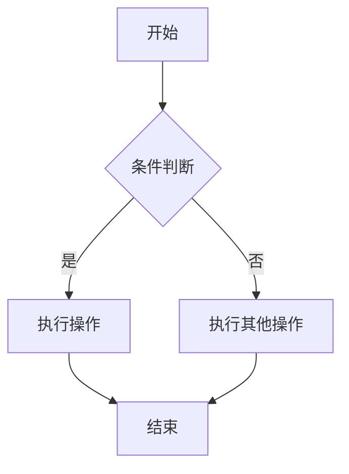
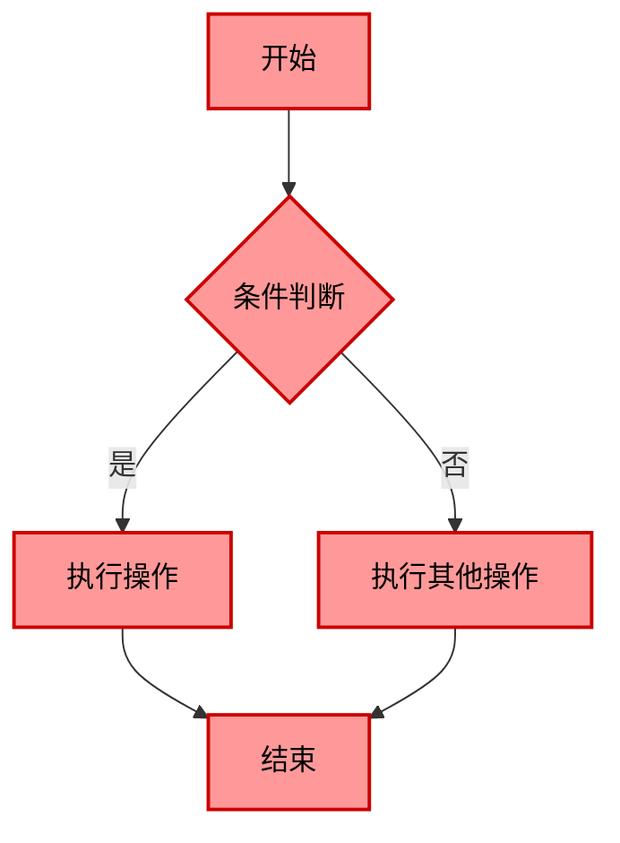

# LLM Conversation Log

## Request

**Role:** system

你是一个助手

**Role:** user

触发 stop 的长输出

**Role:** assistant

MOCK_RESPONSE::触发 stop 的长输出MOCK_RESPONSE::触发 sto [Stopped]

**Role:** user

hi

**Role:** assistant

你好！有什么我可以帮助你的吗？

**Role:** user

请你帮我生成一个简单mermaid图

**Role:** assistant

当然可以！以下是一个简单的 Mermaid 流程图示例，展示了“开始 → 处理 → 结束”的基本流程：

如果你有具体的图表类型（如流程图、时序图、甘特图等）或内容需求，可以告诉我，我可以为你定制生成！

**Role:** user

换成红色节点

---

## Response

好的！以下是修改后的 Mermaid 流程图，节点已设置为红色：

**说明**：
- 通过 `:::redNode` 为每个节点添加了红色样式类。
- `classDef` 定义了红色节点的具体样式：
  - `fill:#ff9999`：浅红色填充
  - `stroke:#cc0000`：深红色边框
  - `stroke-width:2px`：边框粗细
  - `color:#000`：黑色文字

如果需要调整颜色深度、形状或添加其他样式，请随时告诉我！

