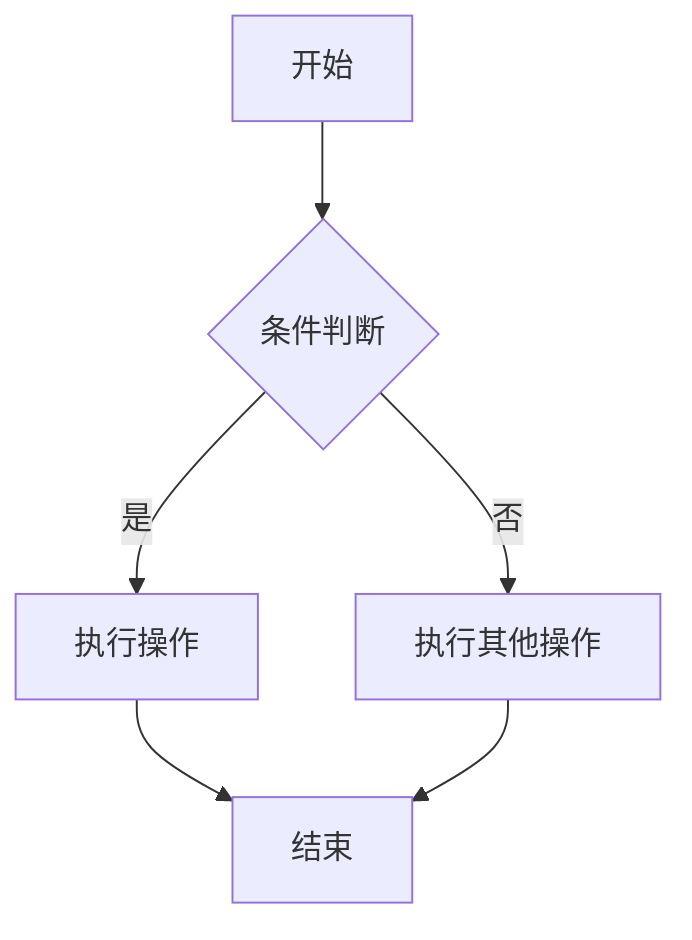
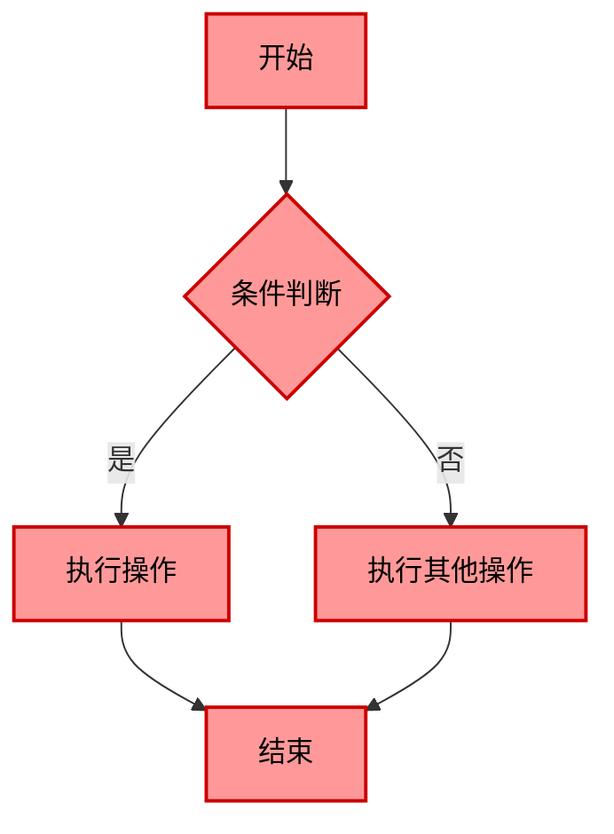

# LLM Conversation Log

## Request

**Role:** system

你是一个助手

**Role:** user

触发 stop 的长输出

**Role:** assistant

MOCK_RESPONSE::触发 stop 的长输出MOCK_RESPONSE::触发 sto [Stopped]

**Role:** user

hi

**Role:** assistant

你好！有什么我可以帮助你的吗？

**Role:** user

请你帮我生成一个简单mermaid图

**Role:** assistant

当然可以！以下是一个简单的 Mermaid 流程图示例，展示了“开始 → 处理 → 结束”的基本流程：

如果你有具体的图表类型（如流程图、时序图、甘特图等）或内容需求，可以告诉我，我可以为你定制生成！

**Role:** user

换成红色节点

**Role:** assistant

好的！以下是修改后的 Mermaid 流程图，节点已设置为红色：

**说明**：
- 通过 `:::redNode` 为每个节点添加了红色样式类。
- `classDef` 定义了红色节点的具体样式：
  - `fill:#ff9999`：浅红色填充
  - `stroke:#cc0000`：深红色边框
  - `stroke-width:2px`：边框粗细
  - `color:#000`：黑色文字

如果需要调整颜色深度、形状或添加其他样式，请随时告诉我！

**Role:** user

给我介绍一下trae AI

---

## Response

关于“Trae AI”，目前没有广泛知名或权威公开的AI系统或平台使用这个确切名称。根据常见的AI领域信息，可能有以下几种情况：

---

### 1. **可能指某个特定产品或项目**
   - **小众/初创AI工具**：可能是某个新兴公司或开发团队推出的AI工具（例如写作助手、数据分析工具等），但尚未形成广泛认知。
   - **拼写或发音近似**：可能是其他知名AI名称的变体（例如“Tree AI”“Tray AI”等），建议确认具体拼写。

---

### 2. **已知的类似名称参考**
   - **AI领域相关术语**：
     - **Tree-based AI**：指基于决策树等树形结构的机器学习模型（如随机森林、梯度提升树）。
     - **Trajectory AI**：专注于轨迹预测或路径规划的AI技术（常用于自动驾驶、机器人导航）。
   - **现有AI平台**：如 **TensorFlow、PyTorch、Hugging Face** 等开源框架，或 **ChatGPT、Claude、Midjourney** 等应用，均无直接关联的“Trae AI”。

---

### 3. **建议核实来源**
   - 如果是从文章、社交媒体或他人推荐中看到该名称，请提供更多上下文（如用途、领域、官网链接等），以便进一步确认。
   - 警惕虚假宣传：少数项目可能使用类似名称进行误导，建议通过官方渠道验证其真实性。

---

如果需要了解具体的AI工具或技术，可以告诉我你的需求（如文本生成、图像处理、编程辅助等），我可以为你推荐成熟可靠的AI工具或资源！ 🚀

