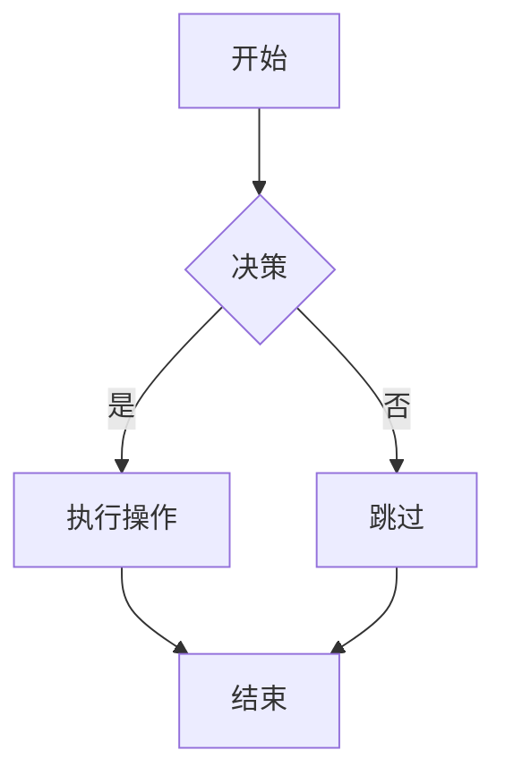
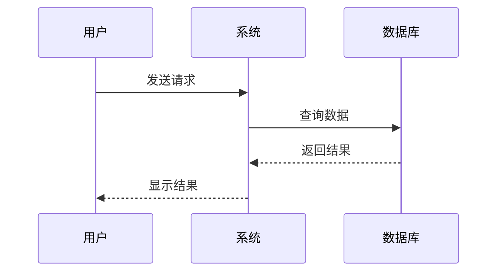
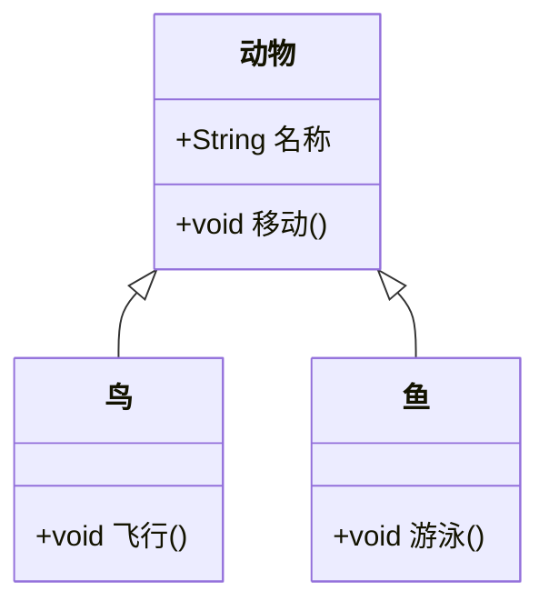
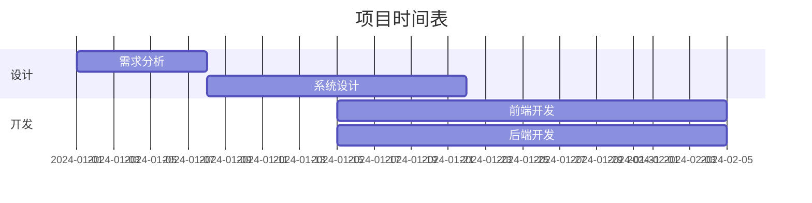
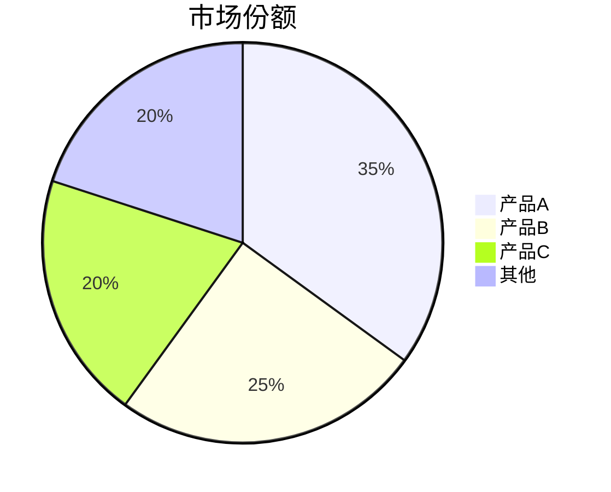

# LLM Conversation Log

## Request

**Role:** system

**Role:** user

给我画个mermaid图

---

## Response

我来帮你画一个Mermaid图！不过我需要知道你想画什么类型的图。Mermaid支持多种图表类型：

## 1. **流程图示例**

## 2. **时序图示例**

## 3. **类图示例**

## 4. **甘特图示例**

## 5. **饼图示例**

**请告诉我你想画什么类型的图？** 比如：
- 系统架构图
- 工作流程图
- 数据库关系图
- 项目时间线
- 或者其他具体需求

我可以根据你的需求生成相应的Mermaid代码！

