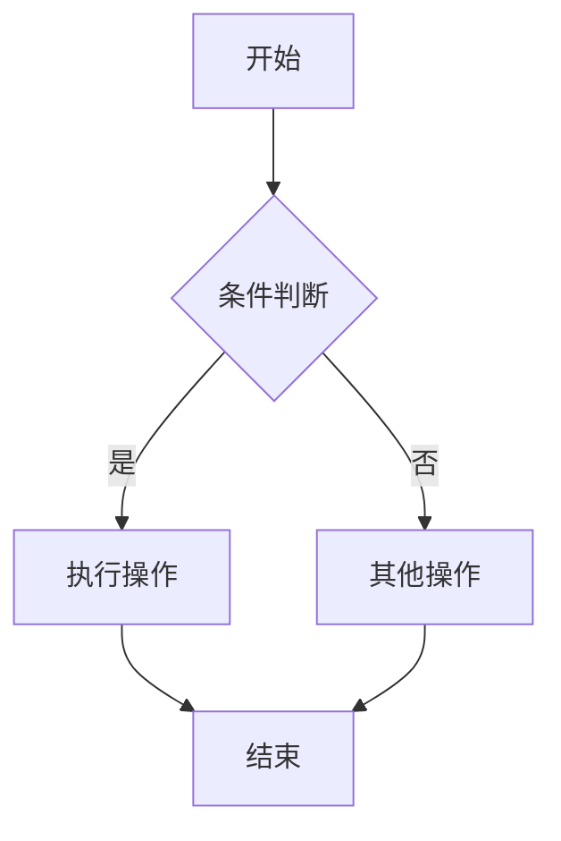
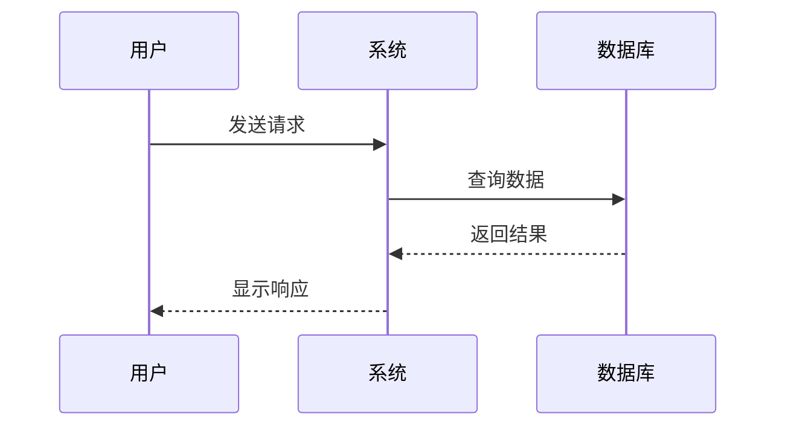
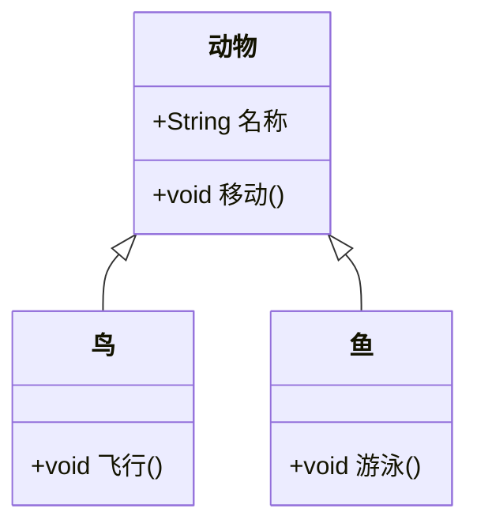
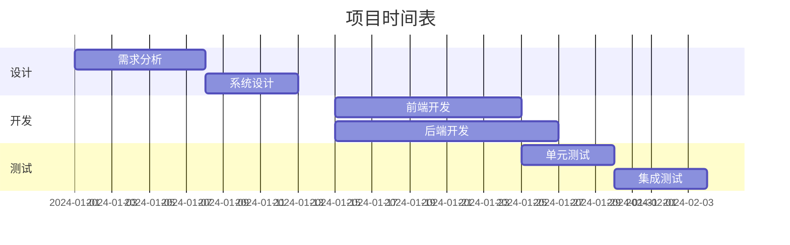
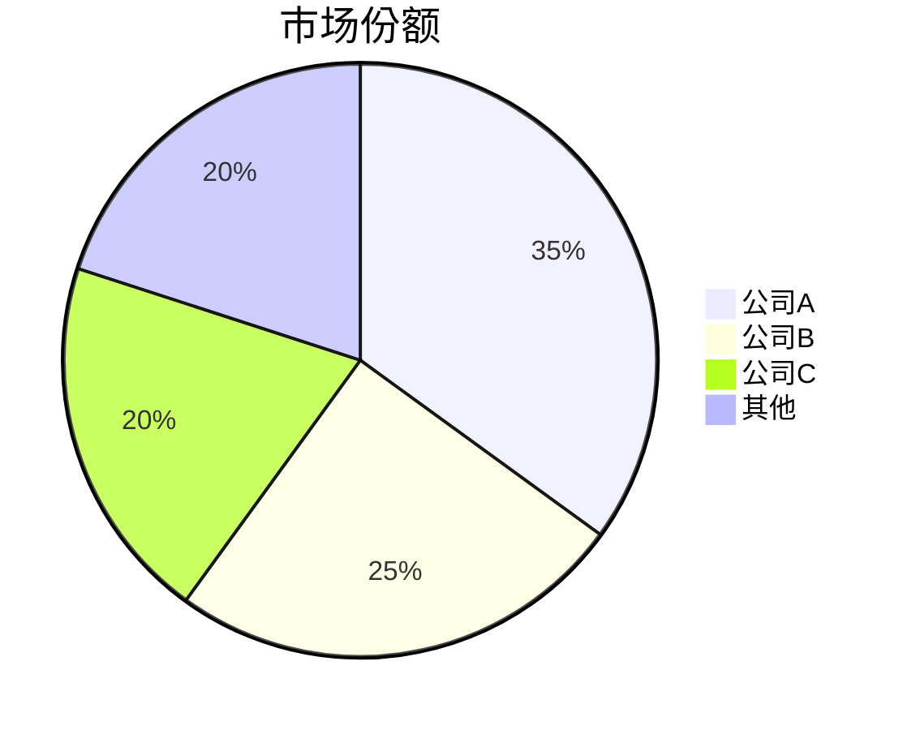
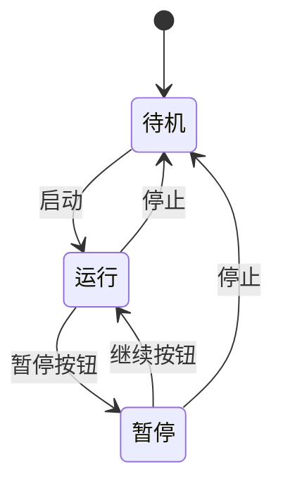

# LLM Conversation Log

## Request

**Role:** system

**Role:** user

给我画个mermaid图

---

## Response

我来帮你画几个常用的Mermaid图示例，你可以选择需要的类型：

## 1. **流程图 (Flowchart)**

## 2. **时序图 (Sequence Diagram)**

## 3. **类图 (Class Diagram)**

## 4. **甘特图 (Gantt Chart)**

## 5. **饼图 (Pie Chart)**

## 6. **状态图 (State Diagram)**

**告诉我你想画什么类型的图，或者描述一下你的需求，我可以为你定制一个更具体的图表！**

例如：
- 你想展示什么流程或关系？
- 需要包含哪些元素？
- 是技术架构图、业务流程图还是其他类型？

