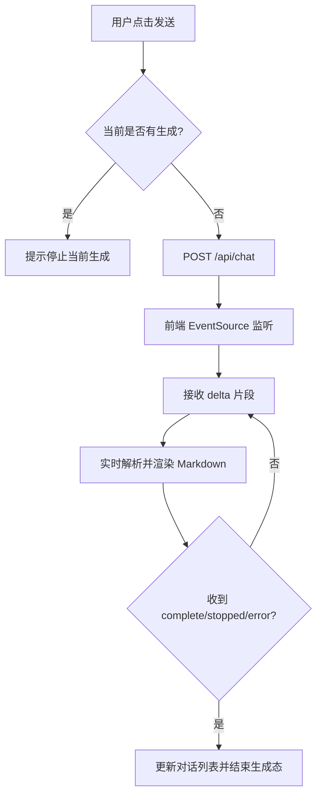
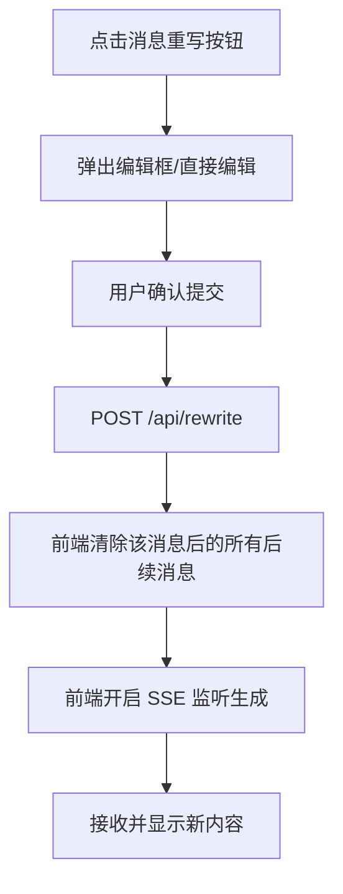

# 对话版本控制系统 (VC-LLM) 设计文档

## 1. 核心定位
本工具旨在提供类似网页端大模型的交互体验，但赋予用户 **API 级别的对话操控权**。通过“一文件一对话”的 Markdown 结构，实现对话的重写（Rewrite）、分叉（Fork）和回滚（Rollback），让对话像代码一样可管理、可复用。

## 2. 核心需求
- **对话历史操控**：
  - **Rewrite**：修改历史中任意位置的 User 或 Assistant 消息，截断后续并重新生成。
  - **Fork**：将当前对话完整复制为新文件，支持多支线并行探索。在 GUI 上表现为两个并行的对话分支。
  - **Rollback**：将对话状态回退到指定历史点（截断文件）。
- **用户隔离与登录**：
  - **登录机制**：支持多用户登录（通过姓名/工号）。
  - **目录隔离**：数据按 `data/conversations/{user_id}/` 目录物理隔离。
- **Markdown 与 Mermaid 渲染**：
  - 前端流式渲染 Markdown 内容，支持 Mermaid 代码块的即时渲染。
  - 支持 Mermaid 代码块实时转化为图表，并提供点击全屏查看功能，全屏模式下支持滚轮缩放。
- **辅助功能**：
  - **停止生成**：生成过程中支持前端发送中止信号。
  - **导出/复制**：提供获取完整 Markdown 源码的端点。
  - **System Prompt 修改**：允许随时调整该对话的设定（Message 0）并影响后续生成。

## 3. 存储设计 (一文件一对话)
每个对话存储为一个独立的 `.md` 文件，包含 Frontmatter 元数据和分段消息体。

### 3.1 文件结构示例
```markdown
---
id: conv_a1b2c3d4
name: 逻辑分析分叉
created_at: 2026-03-10T10:00:00Z
updated_at: 2026-03-10T11:30:00Z
user_id: user_01
---
# Message 0 (System)
你是一个专业的 Python 专家，请用简洁的代码回答问题。

# Message 1 (User)
如何实现一个单例模式？

# Message 2 (Assistant)
可以使用装饰器或元类实现...
```

### 3.2 存储目录
- `data/conversations/{user_id}/{conv_id}.md`
- 这种结构天然支持文件系统级别的备份、同步和人工查阅。

## 4. 前端 UI/UX 设计
前端采用单页应用（SPA）架构，重点在于流式内容渲染与对话树的线性化展示。

### 4.1 布局规划 (Layout)
- **侧边栏 (Sidebar)**：
  - 对话列表：按更新时间倒序排列，显示名称与创建日期。
  - 操作按钮：`新建对话` (New Chat)、`删除对话` (Delete Chat)。
  - 搜索框：根据对话名称实时过滤。
- **主对话区 (Main Content)**：
  - **消息流 (Message Stream)**：渲染 `# Message X` 块，User 与 Assistant 消息左右分列（或通过背景色区分）。支持 Mermaid 图表的即时渲染和点击全屏查看。
  - **输入框 (Input Area)**：位于底部，支持 `Enter` 发送，`Shift+Enter` 换行。
  - **状态指示**：生成中显示 Loading/Stop 按钮。
  - **复制能力 (Copy)**：
    - **消息复制**：每条消息气泡底部提供复制图标按钮，复制该条消息的原始 Markdown。
    - **代码块复制**：每个代码块右上角提供复制图标按钮，复制该代码块内容。
    - **反馈方式**：复制成功/失败不使用弹窗，以轻量视觉反馈（按钮短暂变色/悬浮提示）提示状态。
- **控制栏 (Header/Toolbar)**：
  - 当前对话名称：点击可进行 `Rename`。
  - **System Prompt 按钮**：点击弹出弹窗，允许修改 Message 0。
  - **版本操作组**：
    - `Fork`：复制当前对话。
    - `Export`：导出 Markdown 源码。
    - `Rollback`：显示历史列表，选择消息索引进行回滚（截断）。

### 4.2 核心交互逻辑 (Core Interaction Flow)

#### 4.2.1 SSE 流式生成流程图


#### 4.2.2 历史重写流程图


## 5. 技术栈选择
- **前端**：Vue 3 (CDN), Tailwind CSS (CDN), `markdown-it` (渲染), `mermaid.js` (图表), `highlight.js` (代码高亮).
- **后端**：FastAPI, SSE, `storage_manager.py`.

## 6. API 接口扩展 (前端配套)
- **静态资源托管**：后端需要增加 `StaticFiles` 挂载，将前端 HTML/JS 暴露。
- **对话列表检索**：优化 `GET /api/conversations`，返回更丰富的元数据以支持侧边栏显示。
- **用户登录 (Phase 3)**:
  - `POST /api/login`: 接收 `user_id` (工号/姓名)，在 Session 中记录。
  - `POST /api/logout`: 清除 Session。
  - `GET /api/me`: 获取当前登录用户信息。
  - **登录白名单**：在项目根目录维护 `white_list.json`，仅名单内用户可登录：
    - 支持两种格式：
      - 纯数组：`["user_a","user_b"]`
      - 包装对象：`{"users": ["user_a","user_b"]}`
    - 不在白名单用户登录将返回 `403`，前端弹窗提示。

## 7. 用户隔离逻辑 (Phase 3)
### 7.1 权限校验流程图
```mermaid
graph TD
    A[前端请求 API] --> B{Session 是否有效?}
    B -- 否 --> C[返回 401 Unauthorized]
    B -- 是 --> D[从 Session 获取 user_id]
    D --> E[实例化 StorageManager(user_id)]
    E --> F[执行业务逻辑]
    F --> G[返回结果]
```
### 7.2 登录白名单逻辑
- 读取 `white_list.json` 进行准入控制，未在名单内的用户拒绝登录（HTTP 403）。
- 前端登录框对 403 做出明确提示“该用户不在白名单”。

## 8. 演进路线
- **阶段一 (Done)**：完成一文件一对话存储、SSE 生成通路、Fork/Rewrite 核心逻辑。
- **阶段二 (Done)**：前端 UI 开发（Vue 3 + Tailwind），集成 Markdown/Mermaid 渲染。
- **阶段三 (Next)**：引入用户登录界面与多用户隔离，完善 Session 管理。
